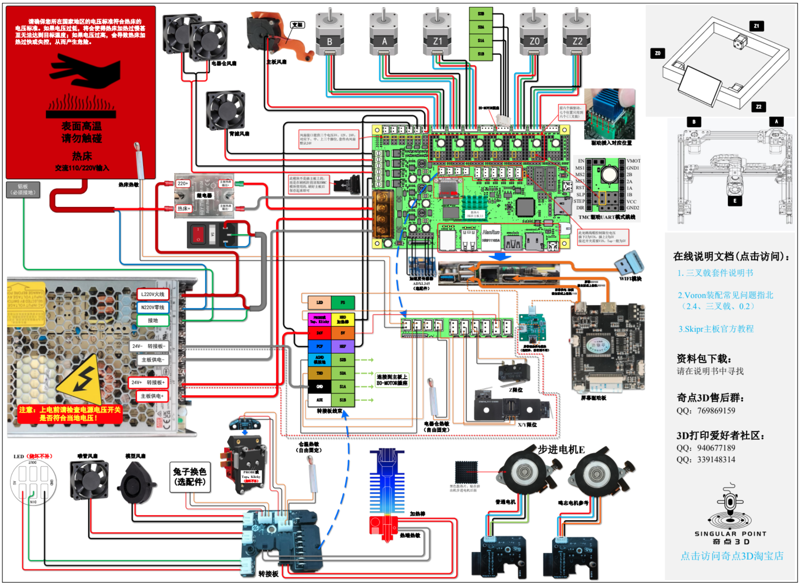

# 一灰VoronTrident省心方案

>### **视频来源**：[Bilibili@我是小一灰](https://www.bilibili.com/video/BV1Na4y1G7fo "我是小一灰")
>### QQ交流群：940677189（满）、339148314（2群）
> ### **Gitee（国内）项目地址**：[VoronTrident省心方案](https://gitee.com/yifeilu/voron-trident "我是小一灰")
> ### **Github项目地址**：[VoronTrident省心方案](https://github.com/YihuiLu/VoronTrident "我是小一灰")

## 方案介绍：
一个被300+人选择的Voron三叉戟装配方案，所有搭配、升级方案都经过挑选和论证，也很容易买到，可以帮助你用更低的成本装出一个高性价比的Voron三叉戟，并有三个预算区间可选。

## 其他资料：
#### **BOM单**：[【腾讯文档】三叉戟BOM](https://docs.qq.com/sheet/DYk5tTHBpSEtPbVh6?tab=BB08J2 "我是小一灰")
#### **BOM单**：[【GoogleDrive】三叉戟BOM](https://drive.google.com/drive/folders/1CQs1cbmclPbKJLRexb8YkByajW4hnJqs?usp=sharing "我是小一灰")

#### **资料包下载地址1**：[阿里云盘 | 提取码：f53j](https://www.aliyundrive.com/s/3trxumG1iBN "我是小一灰")
#### **资料包下载地址2**：[百度云盘 | 提取码：ImYH](https://pan.baidu.com/s/1v2R7Pyi2rMt5dJELF42Imw?pwd=ImYH "我是小一灰")
#### **资料包下载地址3**：[一灰博客](https://drive.yifeilu.cn/aliyun/%E8%A7%86%E9%A2%91%E5%85%B1%E4%BA%AB%E6%96%87%E4%BB%B6/%E4%B8%89%E5%8F%89%E6%88%9F "我是小一灰")

#### 主板、驱动散热风扇支架：已上传至本项目"主板散热支架"文件夹。

##### - ps:中文装配文档在资料包中 -

### **方案中使用到的接线图：**
对于MKS Skipr主板

### 注意事项：

1. 配置文件以此项目为准，可能会更新
2. 由于Git不便存储大文件，所以请结合云盘下载
3. 所有资料优先使用在线版本，离线版本更新很慢
4. 国外小伙伴若无法访问部分资料请提issue

### 其他说明：

1. 本次方案默认为300尺寸方案，而上个2400元Voron2.4的视频为250尺寸，价格不可直接对比
2. 本次方案配件质量、数量全面升级，同上，价格不可直接对比
3. 资料中的中文三叉戟组装文档为一灰自行翻译，转载请注明出处
4. 资料异常若无法联系到一灰可发邮件：yihuiwork@outlook.com